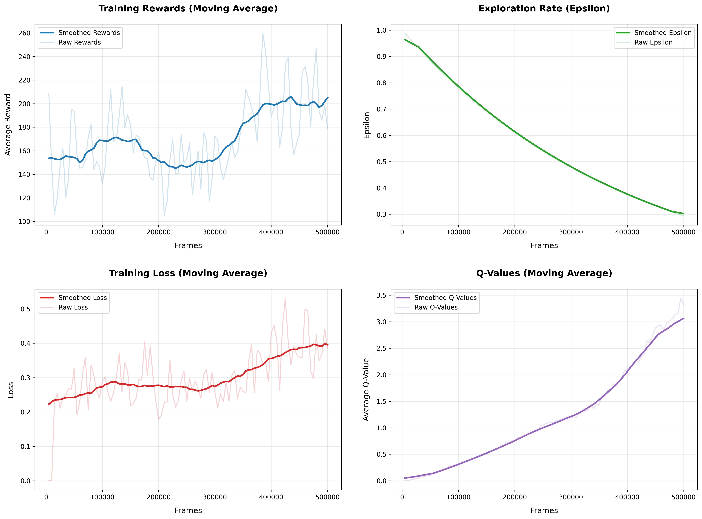

# 🚀 Space Invaders AI - Deep Q-Network (DQN) Implementation

[](https://python.org)
[](https://pytorch.org)
[](https://gymnasium.farama.org)

A complete implementation of Deep Q-Network (DQN) reinforcement learning agent that learns to play Space Invaders at superhuman levels. This project reproduces and extends DeepMind's groundbreaking work on deep reinforcement learning for Atari games.

<div align="center">
  <table>
    <tr>
      <td align="center">
        <br>
        <strong>Moving right and firing</strong>
      </td>
      <td align="center">
        <br>
        <strong>Targeting the pink mother ship</strong>
      </td>
      <td align="center">
        <br>
        <strong>After killing the mother ship</strong>
      </td>
    </tr>
  </table>
</div>

## 🎯 Project Overview

This repository implements a DQN agent that learns to play Space Invaders from raw pixel inputs. The agent achieves human-level performance through:
- **Deep Convolutional Networks** for processing game frames
- **Experience Replay** for stable learning
- **Target Networks** for consistent Q-learning targets
- **Frame Stacking** for temporal information
- **Huber Loss** for robust gradient updates

### 📊 Performance Results
- **Average Score**: 267 ± 64.9 points
- **Best Score**: 375 points
- **Training Time**: ~1 hour on GPU
- **Training Frames**: 500,000

## 🏗️ Architecture

```
Input (4x84x84) → Conv Layers → Fully Connected → Q-Values (6 actions)
       ↓              ↓              ↓              ↓
   4 stacked    32@8x8 stride4  512 units      ['NOOP', 'FIRE', 
   84x84 frames 64@4x4 stride2                'RIGHT', 'LEFT', 
                64@3x3 stride1                'RIGHTFIRE', 'LEFTFIRE']
```

## 🚀 Quick Start

### Prerequisites

```bash
# Install required packages
pip install -r requirements.txt

# Install Atari ROMs (required for gymnasium)
AutoROM --install-roms
```

### Playing a random game

```bash
# Watch the random game play
python Game_Tests\Test_Random_SpaceInvaders.py

```

### Training the Agent

```bash
# Train for 500,000 frames (recommended)
python train.py

# Monitor training progress
python plot_results.py
```

### Testing the Trained Model

```bash
# Watch the trained agent play
python play.py

# Run without rendering (faster)
python play.py --no-render
```

## 📁 Project Structure

```
Atari_SpaceInvaders_DQN/
├── config.py          # Hyperparameters and environment settings
├── model.py           # Neural network architecture
├── train.py           # Main training loop
├── play.py            # Test and visualize trained agent
├── memory.py          # Experience replay buffer
├── utils.py           # Preprocessing and helper functions
├── plot_results.py    # Training visualization
├── requirements.txt   # Python dependencies
├── trained_model.pth  # Saved model weights
└── Game_Tests/
    └── Test_Random_SpaceInvaders.py    # Play a random game
```

## ⚙️ Configuration

Key hyperparameters in `config.py`:

```python
LEARNING_RATE = 0.001      # Optimal learning rate found
BATCH_SIZE = 32            # Experience replay batch size
GAMMA = 0.99               # Discount factor for future rewards
MEMORY_SIZE = 100000       # Replay buffer capacity
TOTAL_FRAMES = 500000      # Training duration
EPSILON_START = 1.0        # Initial exploration rate
EPSILON_END = 0.01         # Final exploration rate
EPSILON_DECAY = 400000     # Exploration decay rate
```

## 🧠 Learning Rate Analysis

We conducted extensive experiments to find the optimal learning rate:

| Learning Rate | Avg Score | Strategy | Stability |
|---------------|-----------|----------|-----------|
| **0.001**     | **267**   | Balanced | High      |
| 0.00025       | 186       | FIRE-spam | Low      |
| 0.0001        | 188       | Mixed    | Medium    |

**LR=0.001** achieved the best balance of performance and learning stability.

## 📈 Training Progress

The training process shows clear learning signals:

- **Q-values** increase from 0.02 to 3.31 (165x improvement)
- **Loss** stabilizes around 0.3-0.4
- **Rewards** consistently improve throughout training
- **Exploration rate** decays smoothly from 1.0 to 0.01



## 🎮 Agent Behavior

The trained agent demonstrates intelligent gameplay:

- **Strategic positioning** using movement actions
- **Timed shooting** instead of random firing
- **Alien tracking** and prediction
- **Defensive maneuvers** to avoid bullets
- **Mothership targeting** for bonus points

## 🔧 Customization

### Modify Training Duration
```python
# In config.py
TOTAL_FRAMES = 1000000  # Train for 1M frames
```

### Try Different Games
```python
# In config.py
ENV_NAME = "ALE/Breakout-v5"  # Switch to Breakout
```

### Experiment with Architectures
```python
# In model.py - modify network layers
self.conv1 = nn.Conv2d(4, 64, kernel_size=8, stride=4)  # More filters
```

## 📚 Learning Resources

- [**Part 0: Intro to RL**](https://becominghuman.ai/lets-build-an-atari-ai-part-0-intro-to-rl-9b2c5336e0ec) - Reinforcement Learning fundamentals
- [**Part 1: DQN**](https://becominghuman.ai/lets-build-an-atari-ai-part-1-dqn-df57e8ff3b26) - Basic DQN implementation
- [**Part 2: DQN Improvements**](https://becominghuman.ai/beat-atari-with-deep-reinforcement-learning-part-2-dqn-improvements-d3563f665a2c) - Advanced techniques
- [**ALE Documentation**](https://ale.farama.org/) - Arcade Learning Environment
- [**Space Invaders Docs**](https://ale.farama.org/environments/space_invaders/) - Game specifics
- [**Breakout Docs**](https://ale.farama.org/environments/breakout/) - Alternative game

## 🛠️ Technical Details

### Preprocessing Pipeline
1. **RGB to Grayscale** - Reduce input dimensions
2. **Downsampling** - 210×160 → 84×84 pixels
3. **Frame Stacking** - 4 consecutive frames as state
4. **Normalization** - Pixel values scaled to [0, 1]

### Training Algorithm
1. **ε-greedy exploration** with exponential decay
2. **Experience replay** with uniform sampling
3. **Target network** updates every 10,000 steps
4. **Huber loss** for robust gradient updates
5. **RMSprop optimizer** with momentum

## 🤝 Contributing

Contributions are welcome! Areas for improvement:

- Implement **Double DQN**
- Add **Dueling Network** architecture
- Try **Prioritized Experience Replay**
- Experiment with **Noisy Networks**
- Add **multi-game** training capability

## 📄 License

This project is for educational purposes. Atari game ROMs are property of their respective owners.

## 🙏 Acknowledgments

- DeepMind for the original DQN paper
- OpenAI for Gym/Gymnasium framework
- PyTorch team for the deep learning framework

---

**⭐ If you find this project helpful, please give it a star!**
